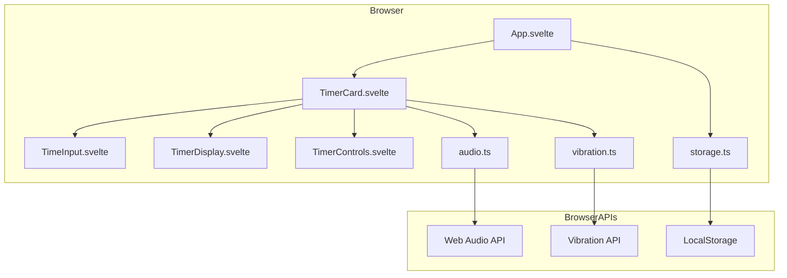
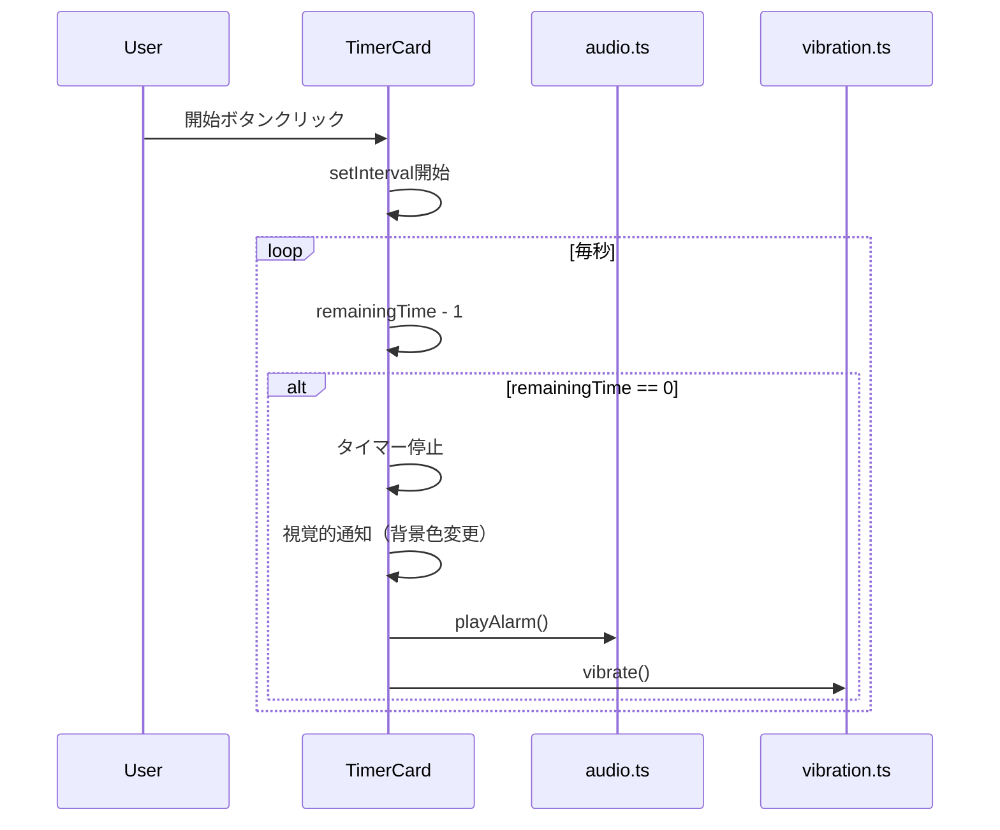
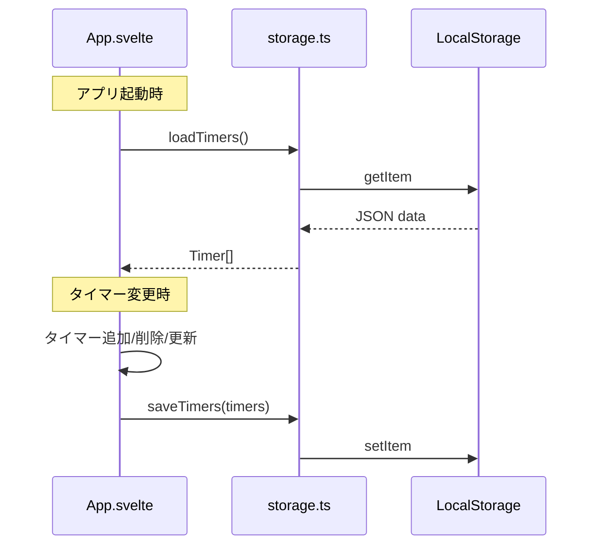
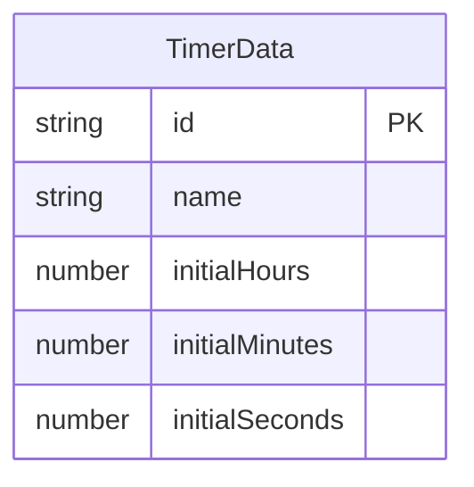

# Design Document

## Overview

**Purpose**: 本機能は、Webブラウザ上で動作する複数タイマー管理アプリケーションを提供する。ユーザーは任意の数のカウントダウンタイマーを作成・管理し、時間管理を効率化できる。

**Users**: 作業時間管理、料理、運動など時間を計測したいすべてのユーザーが対象。

**Impact**: 既存のVite + Svelteテンプレートを完全に置き換え、タイマーアプリケーションとして再構築する。

### Goals
- 複数のカウントダウンタイマーを同時に管理可能
- タイマー設定の永続化によりブラウザ再起動後も復元
- 視覚・聴覚・触覚（対応デバイス）による完了通知
- レスポンシブデザインでデスクトップ・モバイル両対応

### Non-Goals
- ストップウォッチ（カウントアップ）機能
- タイマープリセット・テンプレート機能
- クラウド同期・アカウント管理
- プッシュ通知

## Architecture

### Architecture Pattern & Boundary Map



**Architecture Integration**:
- Selected pattern: Component-based SPA with centralized state management
- Domain boundaries: UIコンポーネント層とユーティリティ層（storage/audio/vibration）を分離
- Existing patterns preserved: Svelte 5 Runes ($state, $derived, $effect)、Tailwind CSS
- New components rationale: タイマー機能に必要なUIコンポーネントとブラウザAPI抽象化層
- Steering compliance: フラットなsrc/lib構成、TypeScript strict mode、Lavenderテーマ

### Technology Stack

| Layer | Choice / Version | Role in Feature | Notes |
|-------|------------------|-----------------|-------|
| Frontend | Svelte 5 | UIコンポーネント、リアクティブ状態管理 | Runes構文（$state, $derived, $effect） |
| Styling | Tailwind CSS v4 | レスポンシブUI、Lavenderテーマ | @tailwindcss/vite経由 |
| Data | LocalStorage | タイマー設定の永続化 | JSON形式で保存 |
| Audio | Web Audio API | アラーム音生成 | Oscillatorで外部ファイル不要 |
| Vibration | Vibration API | 触覚通知（対応デバイスのみ） | iOS非対応のためオプショナル |

## System Flows

### タイマーカウントダウンフロー



### 永続化フロー



## Requirements Traceability

| Requirement | Summary | Components | Interfaces | Flows |
|-------------|---------|------------|------------|-------|
| 1.1 | HH:MM:SS表示 | TimerDisplay | formatTime() | - |
| 1.2 | 1秒更新 | TimerCard | tick() | カウントダウンフロー |
| 1.3 | Lavenderテーマ | 全UIコンポーネント | Tailwind classes | - |
| 2.1 | カウントダウン開始 | TimerCard | start() | カウントダウンフロー |
| 2.2 | 視覚的完了通知 | TimerCard | isCompleted state | カウントダウンフロー |
| 2.3 | アラーム音 | audio.ts | playAlarm() | カウントダウンフロー |
| 2.4 | バイブレーション | vibration.ts | vibrate() | カウントダウンフロー |
| 2.5 | 残り時間表示 | TimerDisplay | - | - |
| 3.1-3.5 | タイマー操作 | TimerControls, TimerCard | start(), pause(), reset() | - |
| 4.1-4.3 | 時間入力 | TimeInput | validateInput() | - |
| 5.1-5.4 | タイマー名 | TimerCard | name state | - |
| 6.1-6.5 | 複数タイマー管理 | App | timers state, addTimer(), removeTimer() | - |
| 7.1-7.4 | データ永続化 | storage.ts, App | loadTimers(), saveTimers() | 永続化フロー |
| 8.1-8.4 | レスポンシブ | 全UIコンポーネント | Tailwind responsive classes | - |

## Components and Interfaces

| Component | Domain/Layer | Intent | Req Coverage | Key Dependencies | Contracts |
|-----------|--------------|--------|--------------|------------------|-----------|
| App.svelte | UI/Container | タイマー配列管理と永続化 | 6.1-6.5, 7.1-7.4 | storage.ts (P0) | State |
| TimerCard.svelte | UI/Feature | 個別タイマーの表示と制御 | 1.1-1.3, 2.1-2.5, 3.1-3.5, 5.1-5.4 | audio.ts (P1), vibration.ts (P2) | State |
| TimeInput.svelte | UI/Input | 時・分・秒の入力 | 4.1-4.3 | - | - |
| TimerDisplay.svelte | UI/Presentation | HH:MM:SS形式表示 | 1.1 | - | - |
| TimerControls.svelte | UI/Presentation | 操作ボタン群 | 3.4-3.5 | - | - |
| storage.ts | Utility | LocalStorage永続化 | 7.1-7.4 | - | Service |
| audio.ts | Utility | アラーム音再生 | 2.3 | - | Service |
| vibration.ts | Utility | バイブレーション | 2.4 | - | Service |

### UI Layer

#### App.svelte

| Field | Detail |
|-------|--------|
| Intent | タイマー配列の一元管理と永続化制御 |
| Requirements | 6.1, 6.2, 6.3, 6.4, 6.5, 7.1, 7.2, 7.3, 7.4 |

**Responsibilities & Constraints**
- タイマー配列のCRUD操作
- 永続化の自動トリガー（$effectによる変更検知）
- タイマーIDの一意性保証

**Dependencies**
- Outbound: storage.ts — タイマーデータ永続化 (P0)
- Outbound: TimerCard.svelte — 個別タイマー表示 (P0)

**Contracts**: State [x]

##### State Management
```typescript
interface TimerData {
  id: string;
  name: string;
  initialHours: number;
  initialMinutes: number;
  initialSeconds: number;
}

// App.svelte内の状態
let timers: TimerData[] = $state([]);

// 永続化トリガー
$effect(() => {
  saveTimers(timers);
});
```

**Implementation Notes**
- Integration: アプリ起動時にloadTimers()でデータ復元、デフォルトは1タイマー
- Validation: タイマーID重複チェック（crypto.randomUUID()使用）
- Risks: LocalStorage容量制限（5MB）は実用上問題なし

#### TimerCard.svelte

| Field | Detail |
|-------|--------|
| Intent | 個別タイマーのカウントダウンロジックとUI表示 |
| Requirements | 1.1, 1.2, 1.3, 2.1, 2.2, 2.3, 2.4, 2.5, 3.1, 3.2, 3.3, 3.4, 3.5, 5.1, 5.2, 5.3, 5.4 |

**Responsibilities & Constraints**
- setIntervalによるカウントダウン制御
- タイマー状態（idle/running/paused/completed）管理
- 完了時の通知トリガー

**Dependencies**
- Inbound: App.svelte — タイマーデータ受け渡し (P0)
- Outbound: audio.ts — アラーム再生 (P1)
- Outbound: vibration.ts — バイブレーション (P2)
- Outbound: TimeInput, TimerDisplay, TimerControls — UI表示 (P1)

**Contracts**: State [x]

##### State Management
```typescript
type TimerStatus = 'idle' | 'running' | 'paused' | 'completed';

interface TimerCardProps {
  timer: TimerData;
  onUpdate: (timer: TimerData) => void;
  onDelete: (id: string) => void;
}

// 内部状態
let status: TimerStatus = $state('idle');
let remainingSeconds: number = $state(0);
let intervalId: number | null = $state(null);
```

**Implementation Notes**
- Integration: onmount時にinitialHours/Minutes/SecondsからremainingSecondsを計算
- Validation: 残り時間が0になったら自動停止、通知発火
- Risks: タブがバックグラウンドになるとsetIntervalが遅延する可能性（許容範囲）

#### TimeInput.svelte

| Field | Detail |
|-------|--------|
| Intent | 時・分・秒の数値入力と検証 |
| Requirements | 4.1, 4.2, 4.3 |

**Implementation Notes**
- 3つのinput[type=number]で時・分・秒を入力
- blur時に有効範囲（時: 0-99, 分: 0-59, 秒: 0-59）に補正
- タイマー動作中は編集不可（disabled）

#### TimerDisplay.svelte / TimerControls.svelte

プレゼンテーショナルコンポーネント。propsで受け取った値を表示/イベントを発火するのみ。

### Utility Layer

#### storage.ts

| Field | Detail |
|-------|--------|
| Intent | タイマーデータのLocalStorage永続化 |
| Requirements | 7.1, 7.2, 7.3, 7.4 |

**Contracts**: Service [x]

##### Service Interface
```typescript
const STORAGE_KEY = 'timer-app-timers';

interface StorageService {
  loadTimers(): TimerData[];
  saveTimers(timers: TimerData[]): void;
}

function loadTimers(): TimerData[] {
  const data = localStorage.getItem(STORAGE_KEY);
  if (!data) return getDefaultTimers();
  try {
    return JSON.parse(data) as TimerData[];
  } catch {
    return getDefaultTimers();
  }
}

function saveTimers(timers: TimerData[]): void {
  localStorage.setItem(STORAGE_KEY, JSON.stringify(timers));
}

function getDefaultTimers(): TimerData[] {
  return [{
    id: crypto.randomUUID(),
    name: 'タイマー 1',
    initialHours: 0,
    initialMinutes: 5,
    initialSeconds: 0
  }];
}
```

**Implementation Notes**
- JSON.parseエラー時はデフォルトにフォールバック
- 型ガードによる読み込みデータの検証を推奨

#### audio.ts

| Field | Detail |
|-------|--------|
| Intent | Web Audio APIによるアラーム音生成 |
| Requirements | 2.3 |

**Contracts**: Service [x]

##### Service Interface
```typescript
let audioContext: AudioContext | null = null;

function getAudioContext(): AudioContext {
  if (!audioContext) {
    audioContext = new AudioContext();
  }
  return audioContext;
}

function playAlarm(
  duration: number = 500,
  frequency: number = 800,
  volume: number = 0.5
): void {
  const ctx = getAudioContext();
  const oscillator = ctx.createOscillator();
  const gainNode = ctx.createGain();

  oscillator.connect(gainNode);
  gainNode.connect(ctx.destination);

  oscillator.type = 'sine';
  oscillator.frequency.value = frequency;
  gainNode.gain.value = volume;

  oscillator.start();
  oscillator.stop(ctx.currentTime + duration / 1000);
}
```

**Implementation Notes**
- AudioContextはシングルトンで再利用（ブラウザ推奨パターン）
- 複数回呼び出しで断続音パターンを実現可能

#### vibration.ts

| Field | Detail |
|-------|--------|
| Intent | Vibration APIによる触覚通知 |
| Requirements | 2.4 |

**Contracts**: Service [x]

##### Service Interface
```typescript
function vibrate(pattern: number | number[] = 200): boolean {
  if (!('vibrate' in navigator)) {
    return false;
  }
  return navigator.vibrate(pattern);
}

function isVibrationSupported(): boolean {
  return 'vibrate' in navigator;
}
```

**Implementation Notes**
- iOS Safari非対応のため、機能検出で対応デバイスのみ動作
- 戻り値でバイブレーションの成功/失敗を判定可能

## Data Models

### Domain Model



**Entities**:
- TimerData: タイマーの設定情報（永続化対象）

**Business Rules**:
- id: UUID形式、アプリ内で一意
- name: 空文字許容、デフォルトは「タイマー N」
- 時間値: 非負整数、時は0-99、分・秒は0-59

### Logical Data Model

**LocalStorage Schema**:
```json
{
  "key": "timer-app-timers",
  "value": [
    {
      "id": "uuid-string",
      "name": "タイマー名",
      "initialHours": 0,
      "initialMinutes": 5,
      "initialSeconds": 0
    }
  ]
}
```

**Consistency**:
- $effectによる変更検知で自動保存（最終的整合性）
- アプリ起動時に必ず読み込み

## Error Handling

### Error Strategy
- LocalStorage読み込みエラー: デフォルトタイマーにフォールバック
- Audio API非対応: サイレントフェイル（視覚通知は継続）
- Vibration API非対応: サイレントフェイル（音声・視覚通知は継続）

### Error Categories and Responses
**User Errors**: 無効な時間入力 → 有効範囲に自動補正
**System Errors**: LocalStorage書き込み失敗 → コンソール警告（データはメモリに保持）

## Testing Strategy

### Unit Tests
- storage.ts: loadTimers/saveTimersの正常系・異常系
- audio.ts: AudioContext生成、playAlarm呼び出し
- vibration.ts: 機能検出、vibrate呼び出し
- 時間計算ロジック（秒→HH:MM:SS変換）

### Component Tests
- TimerCard: 開始/一時停止/リセット操作
- TimeInput: 入力値検証と補正
- App: タイマー追加/削除

### E2E Tests
- タイマー作成→開始→完了→通知の一連フロー
- ブラウザリロード後のタイマー復元
- 複数タイマーの独立動作

## Performance & Scalability

**Target Metrics**:
- 初期表示: 100ms以下（Viteによる高速ビルド）
- タイマー更新: 16ms以下（60fps維持）

**Considerations**:
- タイマー数が多い場合（10+）のsetInterval管理
- 必要に応じてrequestAnimationFrameへの移行を検討
