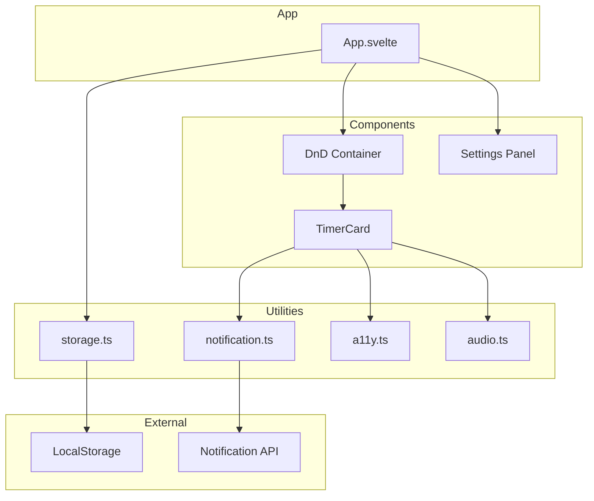
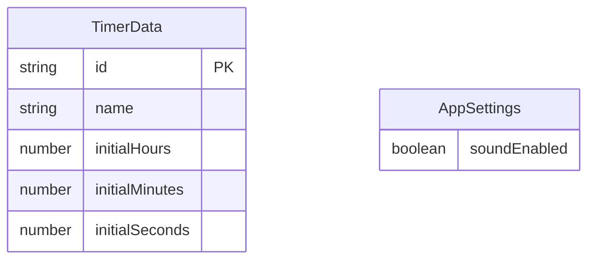
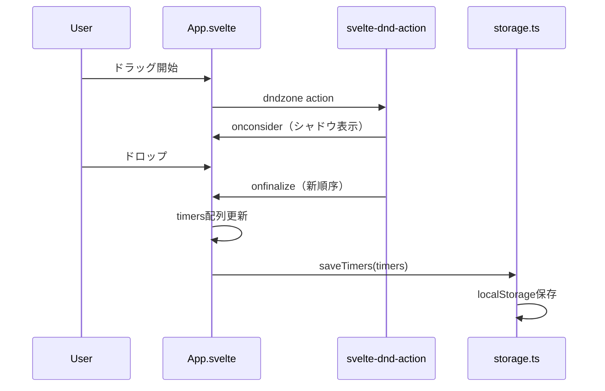
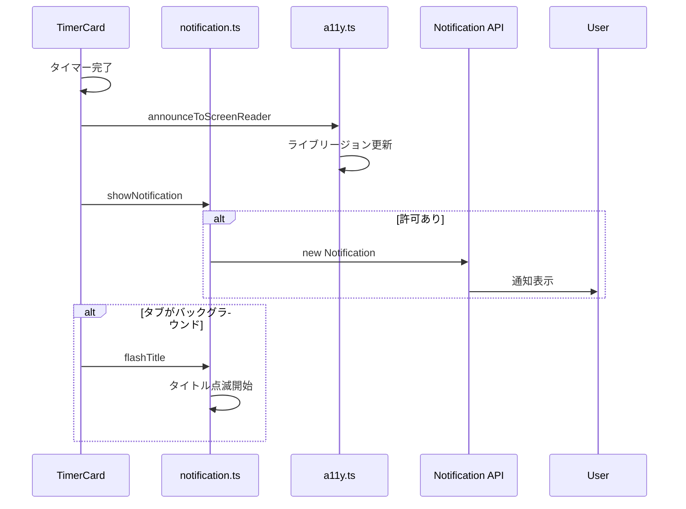

# Design Document

## Overview

**Purpose**: この機能は、タイマーアプリケーションのUI/UX改善を提供します。ドラッグ&ドロップによるタイマー並べ替え、アクセシビリティの強化、タイマー完了通知の改善を実装します。

**Users**: 日常的にタイマーを使用するユーザー、アクセシビリティを必要とするユーザー、マルチタスク中のユーザーが対象です。

**Impact**: 既存のタイマーカードコンポーネントとApp.svelteを拡張し、新規ユーティリティモジュールを追加します。

### Goals
- タイマーカードをドラッグ&ドロップで並べ替え可能にする
- WCAG 2.1 AA基準を満たすアクセシビリティを実現する
- タイマー完了時の通知をブラウザ通知とタイトル点滅で強化する

### Non-Goals
- タイマーの視覚的フィードバック強化（色変化、アニメーション）
- 時間プリセット機能
- レスポンシブデザインの大幅な改善
- ダークモード対応

## Architecture

### Existing Architecture Analysis
- **現在のパターン**: フラットなコンポーネント構成（App.svelte → TimerCard → 子コンポーネント）
- **ドメイン境界**: タイマー管理はApp.svelteで集中管理、各機能はlib/以下のユーティリティで分離
- **統合ポイント**: storage.ts（永続化）、audio.ts（音声）、vibration.ts（触覚）
- **技術的負債**: 特になし

### Architecture Pattern & Boundary Map



**Architecture Integration**:
- **Selected pattern**: 既存パターンの拡張（既存構造に機能追加）
- **Domain boundaries**: UIコンポーネント層とユーティリティ層の分離を維持
- **Existing patterns preserved**: storage.ts/audio.ts/vibration.tsと同様のユーティリティパターン
- **New components rationale**: notification.ts（通知ロジック分離）、a11y.ts（アクセシビリティヘルパー分離）
- **Steering compliance**: フラットな構成、TypeScript strict、Tailwind CSS使用

### Technology Stack

| Layer | Choice / Version | Role in Feature | Notes |
|-------|------------------|-----------------|-------|
| Frontend | Svelte 5 + Runes | UIコンポーネント、状態管理 | 既存 |
| DnD Library | svelte-dnd-action ^0.9.x | ドラッグ&ドロップ機能 | 新規依存 |
| Notification | Web Notifications API | ブラウザ通知 | ブラウザネイティブ |
| Storage | localStorage | 設定・順序の永続化 | 既存 |
| Styling | Tailwind CSS v4 | アクセシビリティ対応スタイル | 既存 |

## Requirements Traceability

| Requirement | Summary | Components | Interfaces | Flows |
|-------------|---------|------------|------------|-------|
| 1.1 | タイマーカードのドラッグで並び順変更 | App.svelte, DnD Container | dndzone action | DnD Flow |
| 1.2 | 新しい順序をlocalStorageに保存 | App.svelte, storage.ts | saveTimers | - |
| 1.3 | ドラッグ中のカードを視覚的に区別 | DnD Container, TimerCard | Tailwind classes | - |
| 1.4 | ドロップ先インジケーター表示 | DnD Container | dndzone shadow | - |
| 2.1 | キーボードフォーカスインジケーター | 全コンポーネント | Tailwind focus classes | - |
| 2.2 | ARIAラベル設定 | 全コンポーネント | aria-label attributes | - |
| 2.3 | ライブリージョン通知 | TimerCard, a11y.ts | announceToScreenReader | - |
| 2.4 | WCAG AA コントラスト比 | 全コンポーネント | Tailwind classes | - |
| 3.1 | ブラウザ通知表示 | TimerCard, notification.ts | showNotification | Notification Flow |
| 3.2 | タイトル点滅 | notification.ts | flashTitle | - |
| 3.3 | 通知クリックでフォーカス移動 | notification.ts | Notification onclick | - |
| 3.4 | 通知音オン/オフ設定 | SettingsPanel, storage.ts | loadSettings, saveSettings | - |

## Components and Interfaces

| Component | Domain/Layer | Intent | Req Coverage | Key Dependencies | Contracts |
|-----------|--------------|--------|--------------|------------------|-----------|
| App.svelte | UI/Container | DnDコンテナ統合、設定管理 | 1.1, 1.2, 1.3, 1.4 | svelte-dnd-action (P0), storage.ts (P0) | State |
| TimerCard.svelte | UI/Presentation | ドラッグ対応、a11y強化 | 1.3, 2.1, 2.2, 2.3, 3.1 | notification.ts (P1), a11y.ts (P1) | - |
| SettingsPanel.svelte | UI/Presentation | 通知音設定UI | 3.4 | storage.ts (P0) | - |
| notification.ts | Utility | 通知ロジック | 3.1, 3.2, 3.3 | Notification API (P0) | Service |
| a11y.ts | Utility | アクセシビリティヘルパー | 2.3 | - | Service |
| storage.ts | Utility | 設定永続化拡張 | 1.2, 3.4 | localStorage (P0) | Service |

### Utility Layer

#### notification.ts

| Field | Detail |
|-------|--------|
| Intent | ブラウザ通知とタイトル点滅機能を提供 |
| Requirements | 3.1, 3.2, 3.3 |

**Responsibilities & Constraints**
- Notification API許可リクエストとステータス管理
- 通知表示とクリックイベントハンドリング
- ページタイトル点滅制御

**Dependencies**
- External: Notification API — ブラウザ通知 (P0)
- External: document.title — タイトル操作 (P0)

**Contracts**: Service [x]

##### Service Interface
```typescript
type NotificationPermissionStatus = 'default' | 'granted' | 'denied';

interface NotificationOptions {
  title: string;
  body?: string;
  icon?: string;
  tag?: string;
  onClick?: () => void;
}

interface NotificationService {
  /** 通知許可をリクエストする */
  requestPermission(): Promise<NotificationPermissionStatus>;

  /** 現在の許可ステータスを取得する */
  getPermissionStatus(): NotificationPermissionStatus;

  /** 通知を表示する（許可されている場合） */
  showNotification(options: NotificationOptions): Notification | null;

  /** ページタイトルを点滅させる */
  flashTitle(message: string, originalTitle: string): () => void;
}
```
- Preconditions: requestPermissionはユーザージェスチャー内で呼び出すこと
- Postconditions: showNotificationは許可がない場合nullを返す
- Invariants: flashTitleは停止関数を返し、呼び出しで点滅を停止

#### a11y.ts

| Field | Detail |
|-------|--------|
| Intent | スクリーンリーダー向けアナウンス機能を提供 |
| Requirements | 2.3 |

**Responsibilities & Constraints**
- ARIAライブリージョンへのメッセージ送信
- ライブリージョン要素のライフサイクル管理

**Dependencies**
- External: DOM API — ライブリージョン要素操作 (P0)

**Contracts**: Service [x]

##### Service Interface
```typescript
type AriaLiveLevel = 'polite' | 'assertive';

interface A11yService {
  /** スクリーンリーダーにメッセージをアナウンスする */
  announceToScreenReader(message: string, level?: AriaLiveLevel): void;
}
```
- Preconditions: なし
- Postconditions: メッセージがライブリージョンに追加される
- Invariants: ライブリージョン要素は自動的にDOMに追加・管理される

#### storage.ts（拡張）

| Field | Detail |
|-------|--------|
| Intent | アプリ設定の永続化機能を追加 |
| Requirements | 3.4 |

**Contracts**: Service [x]

##### Service Interface（追加分）
```typescript
interface AppSettings {
  soundEnabled: boolean;
}

interface StorageServiceExtension {
  /** アプリ設定を読み込む */
  loadSettings(): AppSettings;

  /** アプリ設定を保存する */
  saveSettings(settings: AppSettings): void;
}
```

### UI Layer

#### App.svelte（拡張）

| Field | Detail |
|-------|--------|
| Intent | DnDコンテナ統合と設定パネル配置 |
| Requirements | 1.1, 1.2, 1.3, 1.4 |

**Implementation Notes**
- svelte-dnd-actionのdndzoneアクションを使用
- onconsider/onfinalizeイベントでタイマー配列を更新
- 設定パネルをヘッダーに配置

#### TimerCard.svelte（拡張）

| Field | Detail |
|-------|--------|
| Intent | ドラッグ可能化、アクセシビリティ強化、通知連携 |
| Requirements | 1.3, 2.1, 2.2, 2.3, 3.1 |

**Implementation Notes**
- ドラッグハンドル用のスタイリング追加
- 全ての操作要素にaria-label追加
- タイマー完了時にa11y.announceToScreenReaderを呼び出し
- タイマー完了時にnotification.showNotificationを呼び出し

#### SettingsPanel.svelte（新規）

| Field | Detail |
|-------|--------|
| Intent | 通知音オン/オフ設定UI |
| Requirements | 3.4 |

**Implementation Notes**
- トグルスイッチでsoundEnabledを切り替え
- 変更時にstorage.saveSettingsで永続化
- 通知許可ボタンを含む（ユーザージェスチャー対応）

## Data Models

### Domain Model



**Entities**:
- TimerData: 既存のタイマーデータ（変更なし）
- AppSettings: 新規の設定データ

**Business Rules**:
- タイマーの順序は配列のインデックスで表現（既存の仕組みを活用）
- 設定は独立したストレージキーで管理

### Logical Data Model

**LocalStorage Structure**:
- `timer-app-timers`: TimerData[]（既存、順序は配列順）
- `timer-app-settings`: AppSettings（新規）

## System Flows

### Drag and Drop Flow



### Notification Flow



## Error Handling

### Error Strategy
- 通知APIの許可拒否: タイトル点滅と既存の音声/バイブレーションでフォールバック
- localStorage書き込み失敗: コンソールエラーログ、UIには影響させない
- DnD操作中のエラー: 元の順序を維持

### Error Categories and Responses
**User Errors**: 通知許可拒否 → 設定画面で許可方法を案内
**System Errors**: localStorage容量超過 → エラーログ出力、操作は継続

## Testing Strategy

### Unit Tests
- notification.ts: requestPermission、showNotification、flashTitleの各関数
- a11y.ts: announceToScreenReaderのDOM操作確認
- storage.ts: loadSettings/saveSettingsの読み書き確認

### Integration Tests
- App.svelte + svelte-dnd-action: ドラッグ&ドロップで順序変更確認
- TimerCard + notification.ts: タイマー完了時の通知発火確認
- SettingsPanel + storage.ts: 設定変更の永続化確認

### E2E Tests
- タイマーをドラッグして順序変更、リロード後も維持されることを確認
- 通知許可を与えてタイマー完了、通知が表示されることを確認
- 通知音設定をオフにしてタイマー完了、音が鳴らないことを確認

### Accessibility Tests
- 全ての操作要素にキーボードでアクセス可能なことを確認
- スクリーンリーダーでタイマー状態変更がアナウンスされることを確認
- コントラスト比がWCAG AA基準を満たすことを確認
